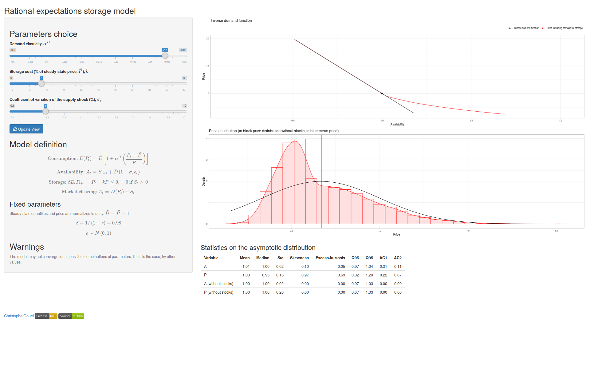

# shiny-storage

[](https://opensource.org/licenses/MIT)

This shiny application illustrates the economic role of competitive storage in a commodity market. It allows to replicate some of the results of [Wright and Williams (1982, Economic Journal)](https://doi.org/10.2307/2232552) but with an isoelastic demand function. When behavioral parameters are changed, the rational expectations storage model is solved using an endogenous grid algorithm.

You can launch the application from R with 
```r
shiny::runGitHub(repo = "christophe-gouel/shiny-storage", subdir = "app", ref = "isoelastic")
```
or use it online at <https://christophe-gouel.shinyapps.io/Storage-model-isoelastic/>.



It is intended for pedagogical purposes. To analyze more complex storage models, have a look at my MATLAB solver [RECS](https://github.com/christophe-gouel/RECS).
